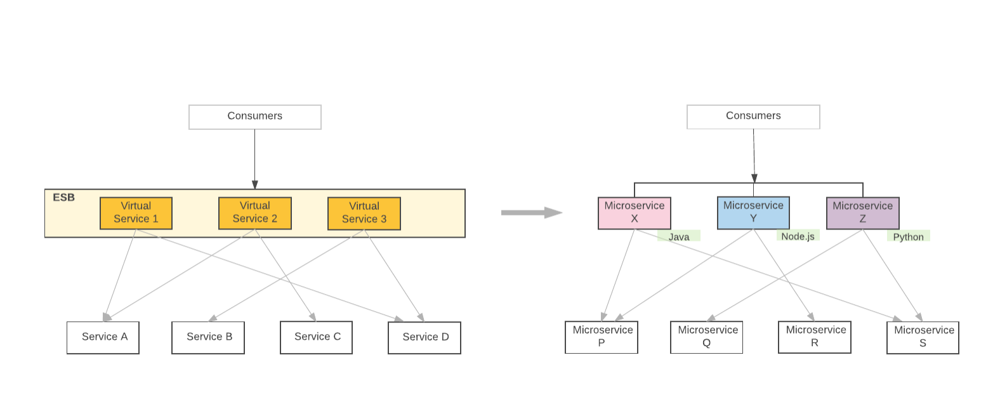
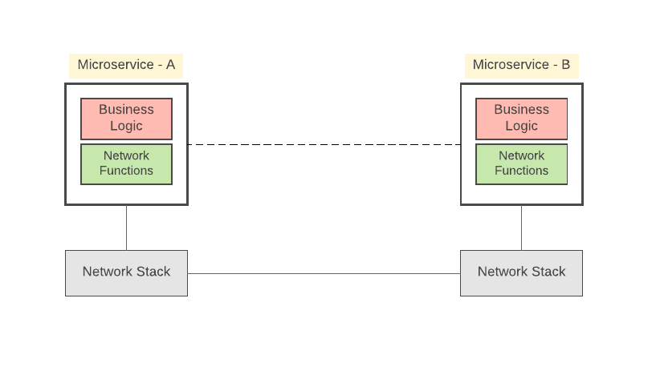
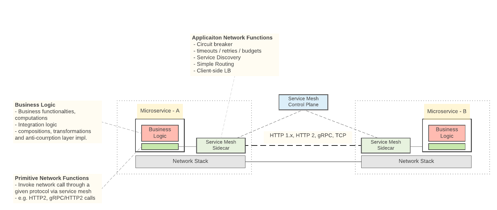

# 服务架构的演变

## 中心化集成（SOA/ESB）到微服务

## 微服务组件和服务间通信

* Business Logic: 实现业务功能

* Network Functions：负责服务间通信机制(通过给定协议的基本服务调用、应用弹性和稳定性模式、服务发现等)，这些网络功能构建在底层OS级网络堆栈之上。

实现微服务体系结构最复杂的挑战不是构建服务本身，而是构建服务之间的通信

## Service Mesh的服务间的通信

