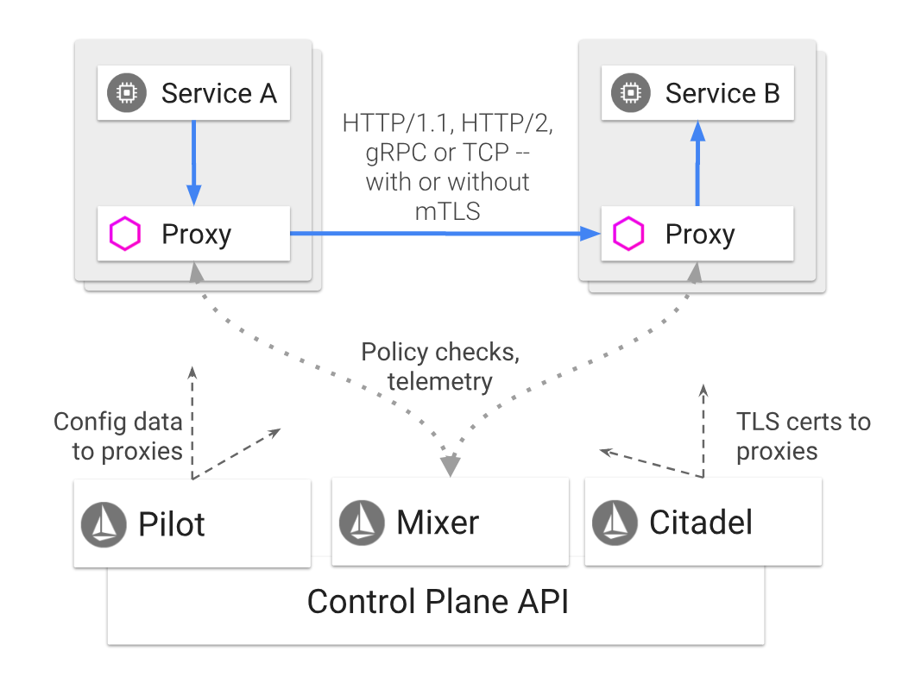

# Istio

[TOC]

## Istio 核心功能

### 流量管理

通过简单的规则配置和流量路由，您可以控制服务之间的流量和 API 调用。Istio 简化了断路器、超时和重试等服务级别属性的配置，并且可以轻松设置 A/B测试、金丝雀部署和基于百分比的流量分割的分阶段部署等重要任务。

通过更好地了解您的流量和开箱即用的故障恢复功能，您可以在问题出现之前先发现问题，使调用更可靠，并且使您的网络更加强大——无论您面临什么条件。

### 安全

Istio 的安全功能使开发人员可以专注于应用程序级别的安全性。Istio 提供底层安全通信信道，并大规模管理服务通信的认证、授权和加密。使用Istio，服务通信在默认情况下是安全的，它允许您跨多种协议和运行时一致地实施策略——所有这些都很少或根本不需要应用程序更改。

虽然 Istio 与平台无关，但将其与 Kubernetes（或基础架构）网络策略结合使用，其优势会更大，包括在网络和应用层保护 pod 间或服务间通信的能力。

### 可观察性

Istio 强大的跟踪、监控和日志记录可让您深入了解服务网格部署。通过 Istio 的监控功能，可以真正了解服务性能如何影响上游和下游的功能，而其自定义仪表板可以提供对所有服务性能的可视性，并让您了解该性能如何影响您的其他进程。

Istio 的 Mixer 组件负责策略控制和遥测收集。它提供后端抽象和中介，将 Istio 的其余部分与各个基础架构后端的实现细节隔离开来，并为运维提供对网格和基础架构后端之间所有交互的细粒度控制。

所有这些功能可以让您可以更有效地设置、监控和实施服务上的 SLO。当然，最重要的是，您可以快速有效地检测和修复问题。

### 平台支持

Istio 是独立于平台的，旨在运行在各种环境中，包括跨云、内部部署、Kubernetes、Mesos 等。您可以在 Kubernetes 上部署 Istio 或具有 Consul 的 Nomad 上部署。Istio 目前支持：

* 在 Kubernetes 上部署的服务
* 使用 Consul 注册的服务
* 在虚拟机上部署的服务

### 集成定制

策略执行组件可以扩展和定制，以便与现有的 ACL、日志、监控、配额、审计等方案集成。

## 架构

Istio 服务网格逻辑上分为数据平面和控制平面。

* 数据平面由一组以 sidecar 方式部署的智能代理（Envoy）组成。这些代理可以调节和控制微服务及 Mixer 之间所有的网络通信。
* 控制平面负责管理和配置代理来路由流量。此外控制平面配置 Mixer 以实施策略和收集遥测数据。

### Envoy

Istio 使用 Envoy 代理的扩展版本，Envoy 是以 C++ 开发的高性能代理，用于调解服务网格中所有服务的所有入站和出站流量。Envoy 的许多内置功能被 istio 发扬光大，例如：

* 动态服务发现
* 负载均衡
* TLS 终止
* HTTP/2 & gRPC 代理
* 熔断器
* 健康检查、基于百分比流量拆分的灰度发布
* 故障注入
* 丰富的度量指标

Envoy 被部署为 sidecar，和对应服务在同一个 Kubernetes pod 中。这允许 Istio 将大量关于流量行为的信号作为属性提取出来，而这些属性又可以在 Mixer 中用于执行策略决策，并发送给监控系统，以提供整个网格行为的信息。

### Mixer

Mixer 是一个独立于平台的组件，负责在服务网格上执行访问控制和使用策略，并从 Envoy 代理和其他服务收集遥测数据。代理提取请求级属性，发送到 Mixer 进行评估。

Mixer 中包括一个灵活的插件模型，使其能够接入到各种主机环境和基础设施后端，从这些细节中抽象出 Envoy 代理和 Istio 管理的服务。

### Pilot

Pilot 为 Envoy sidecar 提供服务发现功能，为智能路由（例如 A/B 测试、金丝雀部署等）和弹性（超时、重试、熔断器等）提供流量管理功能。它将控制流量行为的高级路由规则转换为特定于 Envoy 的配置，并在运行时将它们传播到 sidecar。

Pilot 将平台特定的服务发现机制抽象化并将其合成为符合 Envoy 数据平面 API 的任何 sidecar 都可以使用的标准格式。这种松散耦合使得 Istio 能够在多种环境下运行（例如，Kubernetes、Consul、Nomad），同时保持用于流量管理的相同操作界面。

### Citadel

Citadel 通过内置身份和凭证管理可以提供强大的服务间和最终用户身份验证。可用于升级服务网格中未加密的流量，并为运维人员提供基于服务标识而不是网络控制的强制执行策略的能力。从 0.5 版本开始，Istio 支持基于角色的访问控制，以控制谁可以访问您的服务。

